# NaVi 전주 PoC 촬영·인식·AR 실험 기록

2026-09-18~19 개발 기록. 전북대학교 전주캠퍼스에서 수집한 5개 자료와 이후 실험·화면 변경을 한곳에 모았다. **사진·이미지 204개, 이 중 개별 현장 사진 153장**, 대표 영상 장면 6장, 검토용 영상 4개, 탐지 결과표와 검사 기록을 포함한다. 아래 사진은 클릭하면 원본 크기로 열린다.

이 문서는 새 추론이나 새 현장 실험 결과가 아니다. 기존 촬영과 실험 결과를 재집계하고 보관한 기록이다. 성공한 부분뿐 아니라 오검출, 준비 실패, 공간 판단 보류와 설계 변경도 함께 남겼다.

- [대표 장면](#대표-장면)
- [진행 과정](#진행-과정)
- [촬영 5개와 전체 사진](#촬영-5개와-전체-사진)
- [촬영 당시 객체 인식 검토](#촬영-당시-객체-인식-검토)
- [콘 검출 실험](#콘-검출-실험)
- [공간 판단과 우회 경로 변경](#공간-판단과-우회-경로-변경)
- [라인에서 화살표로](#라인에서-화살표로)
- [실제 앱의 중간 화면](#실제-앱의-중간-화면)
- [검사 기록과 현재 상태](#검사-기록과-현재-상태)
- [파일 구조와 재현](#파일-구조와-재현)

## 대표 장면

다음 6장은 실제 `recording.mp4`에서 추출했다. 밝기 보정이나 AR 합성을 하지 않았다. 시각·원본 해시는 [추출 기록](records/video-stills-manifest.json)에 있다.

<table>
<tr>
<td valign="top"><a href="photos/02-video-highlights/01_path.png">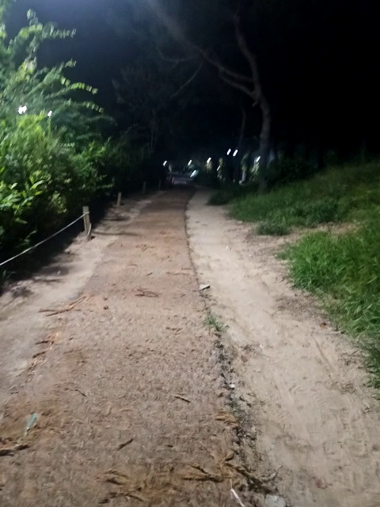</a><br>보행로 전경</td>
<td valign="top"><a href="photos/02-video-highlights/02_construction_cones.png">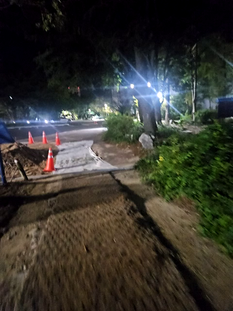</a><br>콘과 공사 구간</td>
<td valign="top"><a href="photos/02-video-highlights/03_side_cones.png">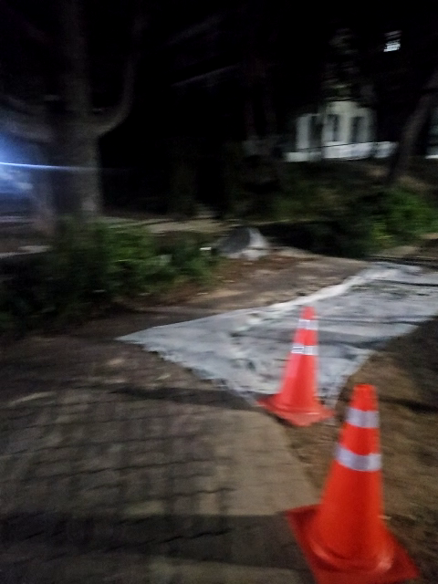</a><br>보행로 가장자리의 콘</td>
</tr>
<tr>
<td valign="top"><a href="photos/02-video-highlights/04_passing_person.png">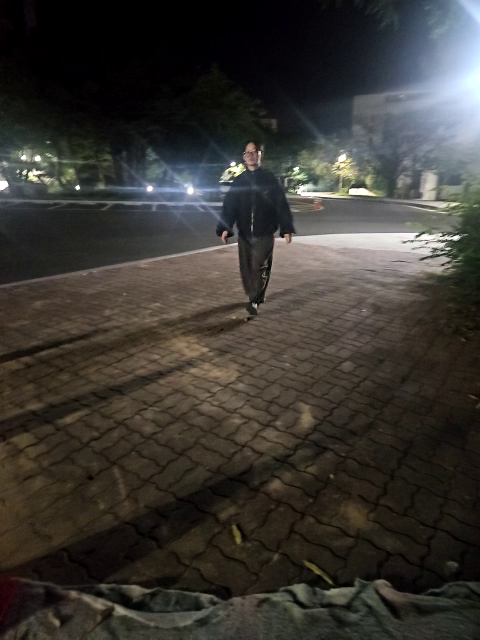</a><br>사람이 지나가는 구간</td>
<td valign="top"><a href="photos/02-video-highlights/05_outer_walkway.png">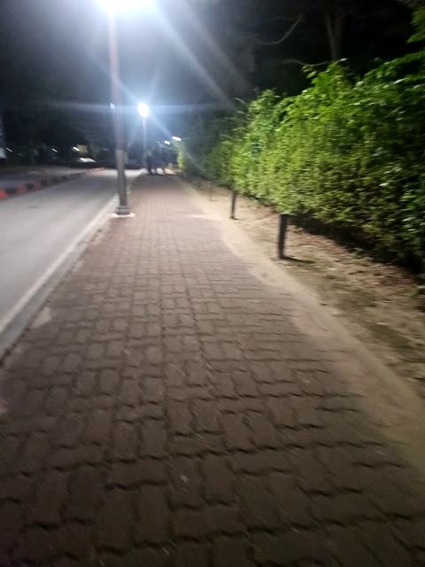</a><br>도로 옆 보행로</td>
<td valign="top"><a href="photos/02-video-highlights/06_curved_walkway.png"></a><br>곡선으로 이어지는 보행로</td>
</tr>
</table>

## 진행 과정

시간대는 한국 시간이다. 초기 실행은 폴더의 실행 시각, 촬영은 수집 ID, 후속 개발은 검사 기록 순서로 구분했다. 파일 수정 시각을 실험 시각으로 추정하지 않았다.

| 단계 | 수행한 내용 | 남은 기록 / 결과 |
|---|---|---|
| 9/18 23:29~9/19 00:50 | Android SelfTest, 모델 로딩, 서버 경로 확인, 준비·실패 처리 | 실제 에뮬레이터 화면, 실행 요약. 현장 AR 검증과 구분 |
| 9/19 02:05경 | S23 버튼 하나로 수집하는 기능 검사 | 중단 시점까지 110프레임 저장한 앱 화면 |
| 02:23~02:50경 | 사용자 현장 촬영 5회 | 약 12분 46초, CPU 샘플 2,946장, 센서와 원본 영상 |
| 촬영본 반입 후 | 원본 무결성·디코딩, 저장된 탐지 결과 검토 | 1,437개 탐지 박스, C02/C03 후보, 오검출 표본 |
| 콘 대상으로 전환 | 주황색·흰 띠·형태 규칙을 추가하고 동일 Kotlin 검출기에 원본 픽셀 입력 | 현재 규칙에서 129프레임 / 143개 콘 후보 |
| 고정 출발점 PoC | 사용자 출발 방향으로 상대 AR 정렬, 평면 보조, 진행·음성·우회 연동 | 기존 녹화의 지속 조건 통과 관측 0개. 보류 원인 기록 |
| AR 표현 검토 | 연속 파란 라인·띠 설명 이미지 제작 후 화살표 형태 검토 | 설명용 합성 이미지 2개. 실제 앱 캡처와 분리 |
| 지정 우회 코스 반영 | 장애물 앞에서 되돌아가 동쪽 곡선 보행로로 이동, 아래 합류점 종료 | 내장 코스·오프라인 안내, 실제 콘 신호 또는 수동 확인 |
| 실제 AR 렌더러 변경 | 약 2m 간격의 바닥 화살표를 코드에 적용 | `FloorArrowGeometry.kt`, 경로 방향을 따르는 삼각형 렌더링 |
| 객체 표시 정리 | 객체명·점수·종류별 색상과 코너 박스, 요청 문구 2개 삭제 | 새 APK 빌드·단위 검사·lint 통과. 최신 S23 설치 미수행 |

## 촬영 5개와 전체 사진

| 촬영 | 수집 시작 ID | 영상 길이 | CPU 샘플 | 콘 박스 / 콘 프레임 |
|---|---|---:|---:|---:|
| 1 | `022341` | 180.457초 | 690 | 41 / 39 |
| 2 | `023430` | 180.453초 | 685 | 15 / 15 |
| 3 | `024105` | 44.331초 | 203 | 17 / 17 |
| 4 | `024204` | 180.347초 | 654 | 36 / 25 |
| 5 | `024719` | 180.392초 | 714 | 34 / 33 |

4개는 약 180초 자동 완료, 촬영 3은 약 44초에 중단 저장했다. 아래 사진은 **수집 경과 시간 기준 5초 간격에 가장 가까운 CPU 프레임**이다. 원래 회전값을 적용하고 JPEG 95로 내보냈다. 밝기 조정·박스·경로 합성은 없다. 사진 시각은 MP4 재생 시각과 독립적인 수집 시각이므로 정밀하게 동기화됐다고 해석하지 않는다.

<details>
<summary>촬영 1: NaVi-collect-20260919-022341-193-a2b8792d · 사진 36장</summary>

<table>
<tr>
<td valign="top"><a href="photos/01-field/clip-01/t0000.10-f00002.jpg">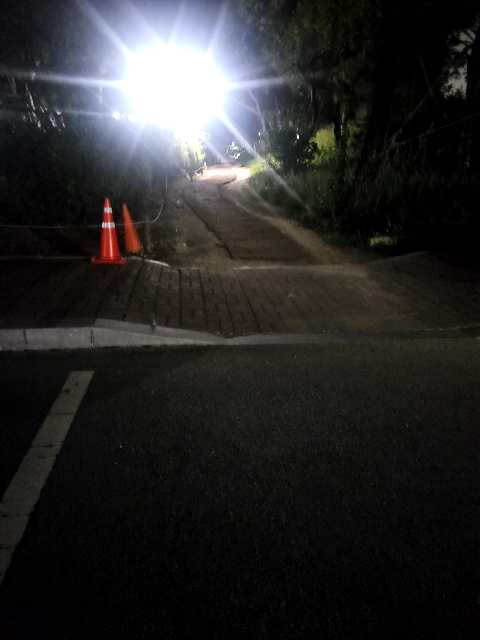</a><br>촬영 1 · 0.10초 · 프레임 2</td>
<td valign="top"><a href="photos/01-field/clip-01/t0004.80-f00025.jpg">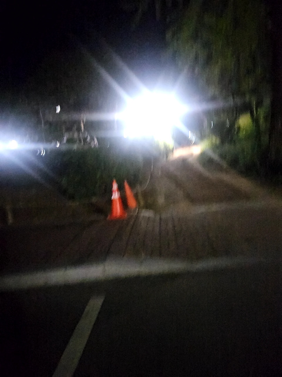</a><br>촬영 1 · 4.80초 · 프레임 25</td>
<td valign="top"><a href="photos/01-field/clip-01/t0010.05-f00051.jpg">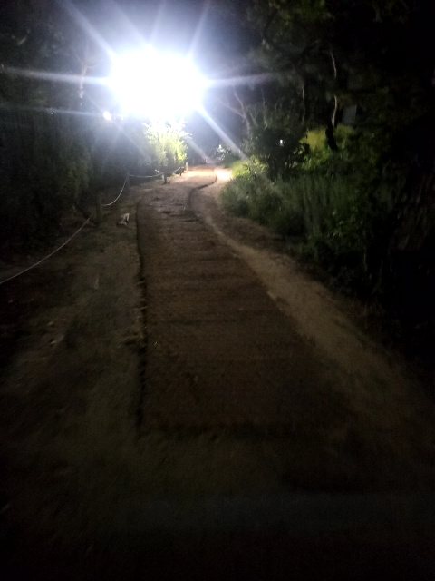</a><br>촬영 1 · 10.05초 · 프레임 51</td>
</tr>
<tr>
<td valign="top"><a href="photos/01-field/clip-01/t0015.08-f00076.jpg">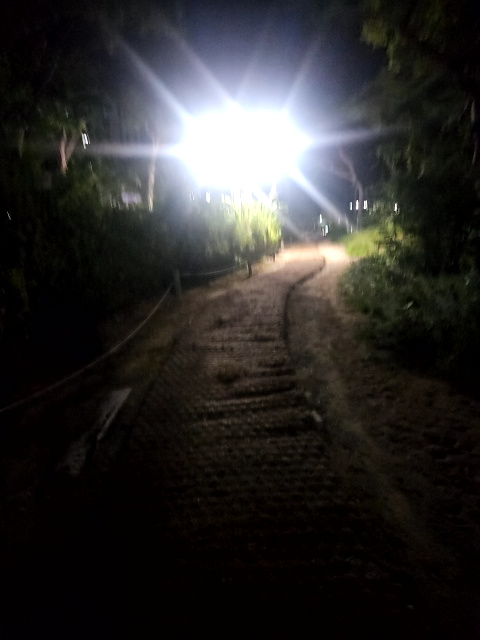</a><br>촬영 1 · 15.08초 · 프레임 76</td>
<td valign="top"><a href="photos/01-field/clip-01/t0020.01-f00100.jpg">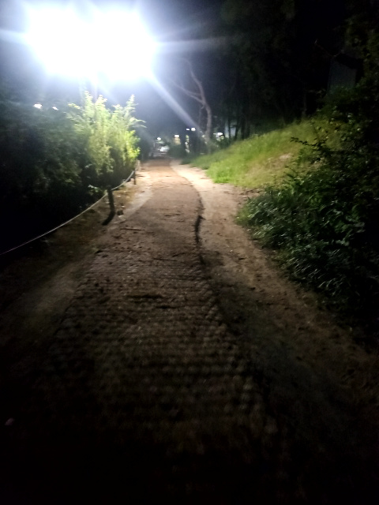</a><br>촬영 1 · 20.01초 · 프레임 100</td>
<td valign="top"><a href="photos/01-field/clip-01/t0025.02-f00123.jpg">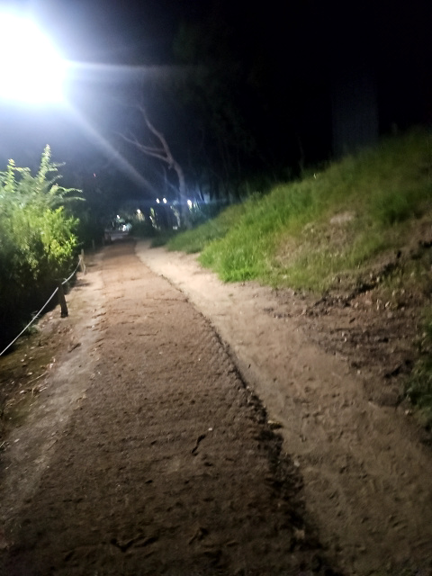</a><br>촬영 1 · 25.02초 · 프레임 123</td>
</tr>
<tr>
<td valign="top"><a href="photos/01-field/clip-01/t0029.94-f00146.jpg">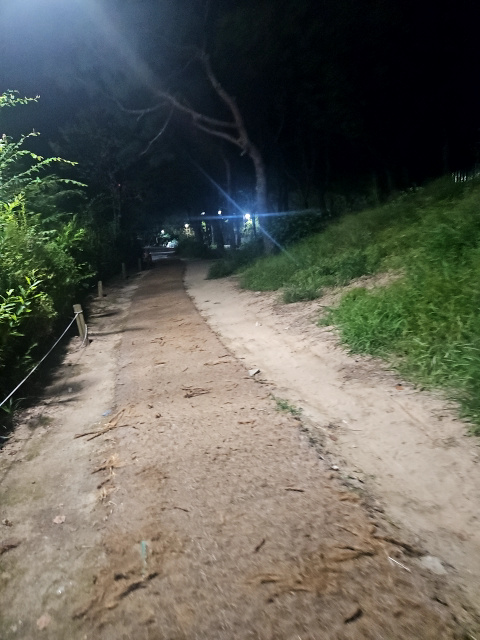</a><br>촬영 1 · 29.94초 · 프레임 146</td>
<td valign="top"><a href="photos/01-field/clip-01/t0035.01-f00169.jpg">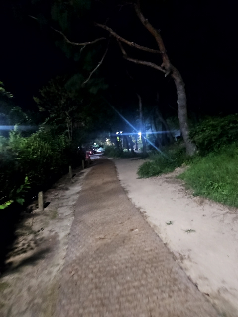</a><br>촬영 1 · 35.01초 · 프레임 169</td>
<td valign="top"><a href="photos/01-field/clip-01/t0040.03-f00193.jpg">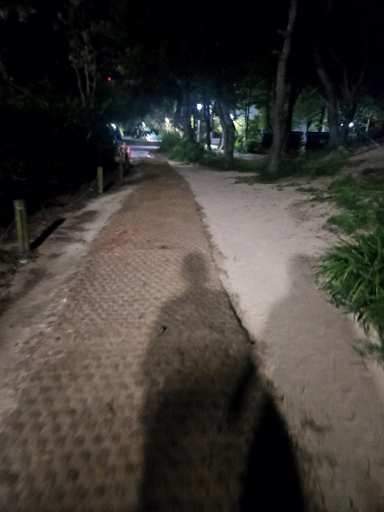</a><br>촬영 1 · 40.03초 · 프레임 193</td>
</tr>
<tr>
<td valign="top"><a href="photos/01-field/clip-01/t0045.05-f00218.jpg">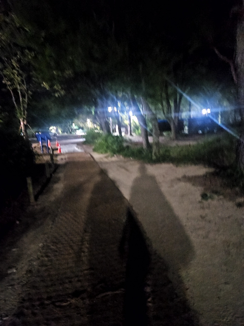</a><br>촬영 1 · 45.05초 · 프레임 218</td>
<td valign="top"><a href="photos/01-field/clip-01/t0050.07-f00243.jpg">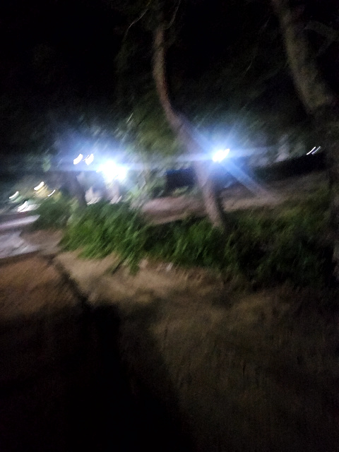</a><br>촬영 1 · 50.07초 · 프레임 243</td>
<td valign="top"><a href="photos/01-field/clip-01/t0055.08-f00268.jpg">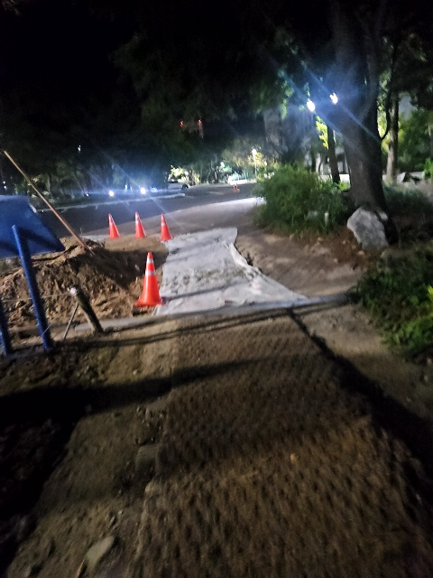</a><br>촬영 1 · 55.08초 · 프레임 268</td>
</tr>
<tr>
<td valign="top"><a href="photos/01-field/clip-01/t0060.10-f00293.jpg">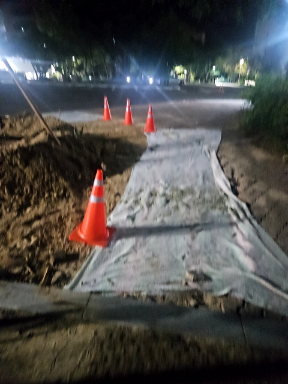</a><br>촬영 1 · 60.10초 · 프레임 293</td>
<td valign="top"><a href="photos/01-field/clip-01/t0064.91-f00317.jpg">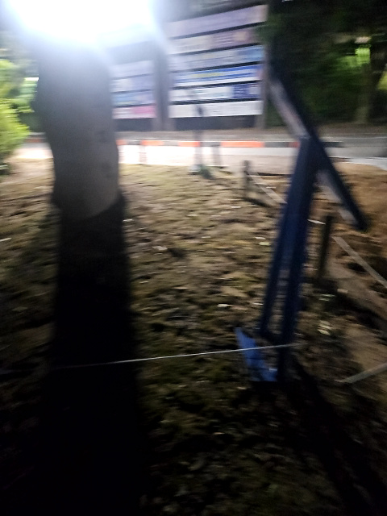</a><br>촬영 1 · 64.91초 · 프레임 317</td>
<td valign="top"><a href="photos/01-field/clip-01/t0069.93-f00342.jpg">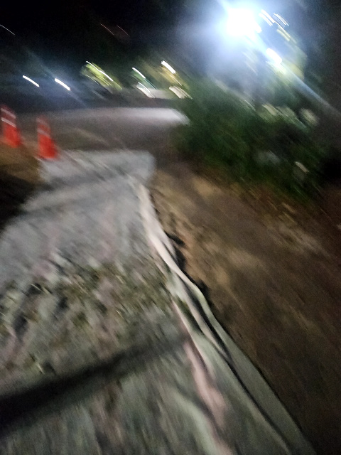</a><br>촬영 1 · 69.93초 · 프레임 342</td>
</tr>
<tr>
<td valign="top"><a href="photos/01-field/clip-01/t0074.96-f00367.jpg">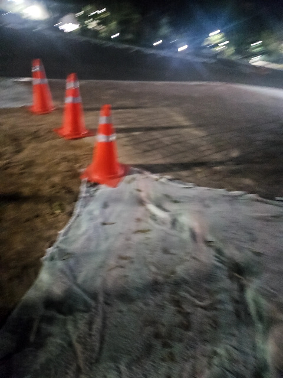</a><br>촬영 1 · 74.96초 · 프레임 367</td>
<td valign="top"><a href="photos/01-field/clip-01/t0079.97-f00392.jpg">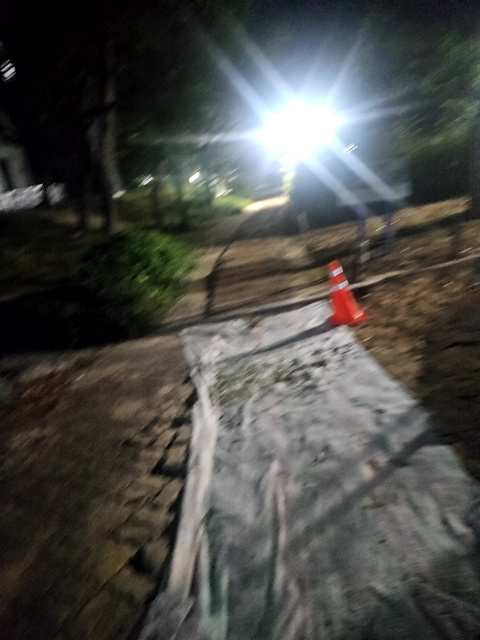</a><br>촬영 1 · 79.97초 · 프레임 392</td>
<td valign="top"><a href="photos/01-field/clip-01/t0084.98-f00417.jpg">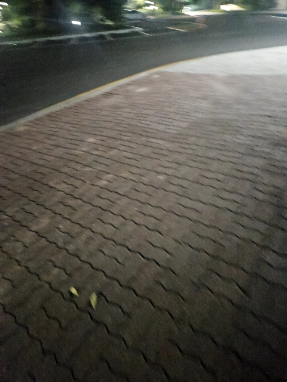</a><br>촬영 1 · 84.98초 · 프레임 417</td>
</tr>
<tr>
<td valign="top"><a href="photos/01-field/clip-01/t0090.02-f00442.jpg">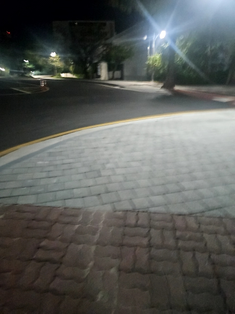</a><br>촬영 1 · 90.02초 · 프레임 442</td>
<td valign="top"><a href="photos/01-field/clip-01/t0094.98-f00465.jpg">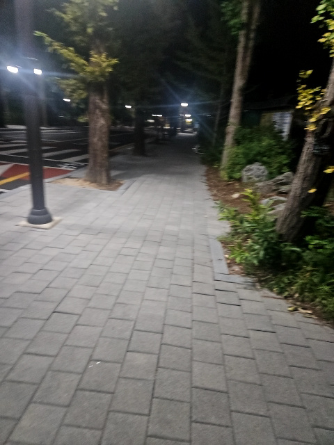</a><br>촬영 1 · 94.98초 · 프레임 465</td>
<td valign="top"><a href="photos/01-field/clip-01/t0100.22-f00489.jpg">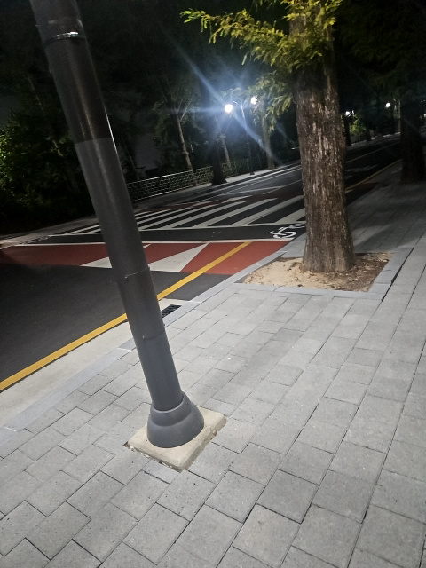</a><br>촬영 1 · 100.22초 · 프레임 489</td>
</tr>
<tr>
<td valign="top"><a href="photos/01-field/clip-01/t0104.99-f00511.jpg">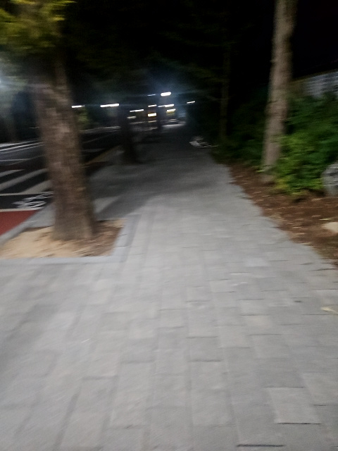</a><br>촬영 1 · 104.99초 · 프레임 511</td>
<td valign="top"><a href="photos/01-field/clip-01/t0110.19-f00535.jpg">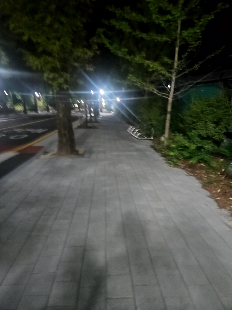</a><br>촬영 1 · 110.19초 · 프레임 535</td>
<td valign="top"><a href="photos/01-field/clip-01/t0115.00-f00559.jpg">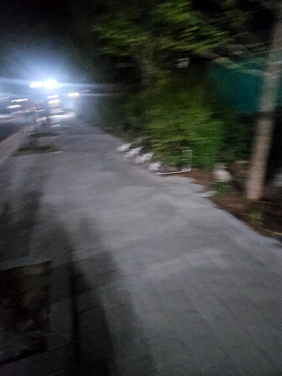</a><br>촬영 1 · 115.00초 · 프레임 559</td>
</tr>
<tr>
<td valign="top"><a href="photos/01-field/clip-01/t0120.04-f00584.jpg">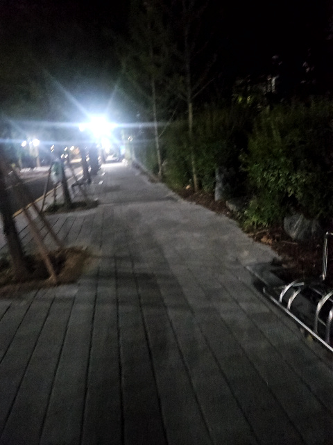</a><br>촬영 1 · 120.04초 · 프레임 584</td>
<td valign="top"><a href="photos/01-field/clip-01/t0125.03-f00609.jpg">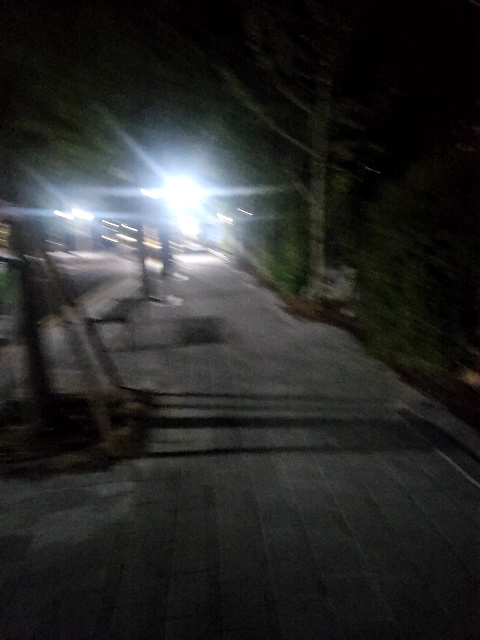</a><br>촬영 1 · 125.03초 · 프레임 609</td>
<td valign="top"><a href="photos/01-field/clip-01/t0130.05-f00634.jpg">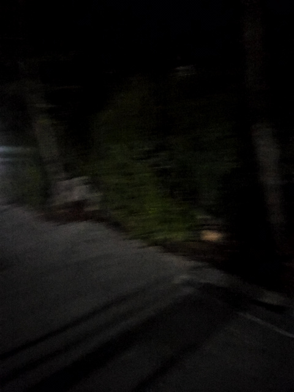</a><br>촬영 1 · 130.05초 · 프레임 634</td>
</tr>
<tr>
<td valign="top"><a href="photos/01-field/clip-01/t0135.08-f00659.jpg">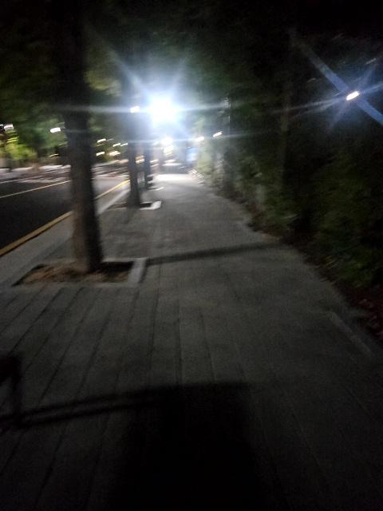</a><br>촬영 1 · 135.08초 · 프레임 659</td>
<td valign="top"><a href="photos/01-field/clip-01/t0140.07-f00684.jpg">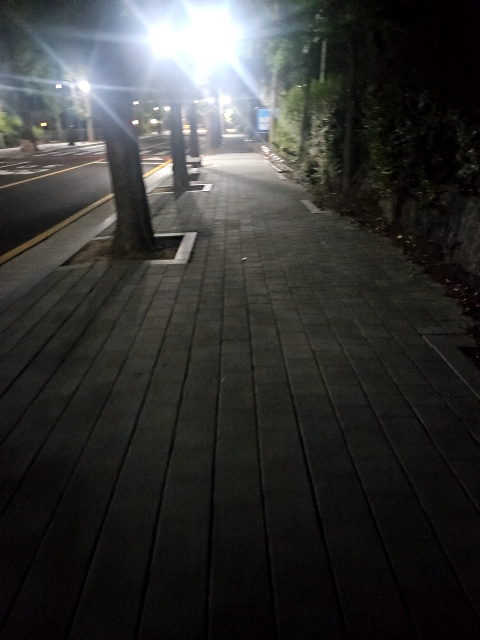</a><br>촬영 1 · 140.07초 · 프레임 684</td>
<td valign="top"><a href="photos/01-field/clip-01/t0144.91-f00708.jpg">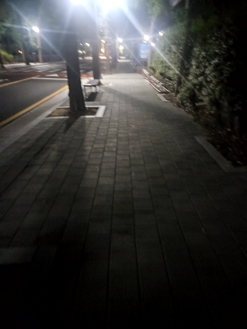</a><br>촬영 1 · 144.91초 · 프레임 708</td>
</tr>
<tr>
<td valign="top"><a href="photos/01-field/clip-01/t0149.90-f00732.jpg">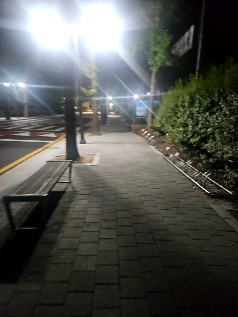</a><br>촬영 1 · 149.90초 · 프레임 732</td>
<td valign="top"><a href="photos/01-field/clip-01/t0155.07-f00756.jpg">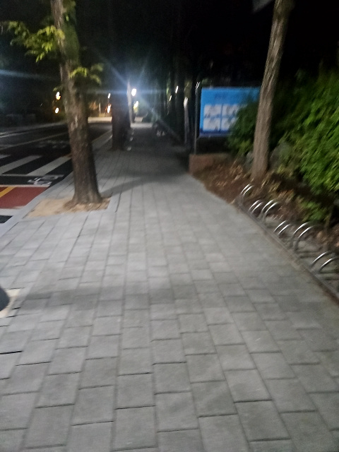</a><br>촬영 1 · 155.07초 · 프레임 756</td>
<td valign="top"><a href="photos/01-field/clip-01/t0159.94-f00779.jpg">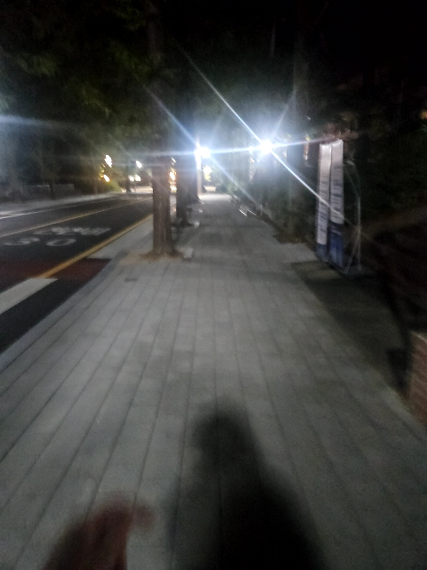</a><br>촬영 1 · 159.94초 · 프레임 779</td>
</tr>
<tr>
<td valign="top"><a href="photos/01-field/clip-01/t0164.96-f00804.jpg">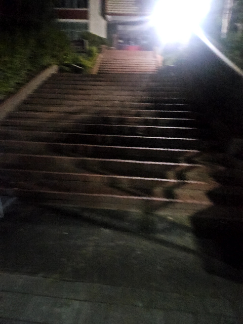</a><br>촬영 1 · 164.96초 · 프레임 804</td>
<td valign="top"><a href="photos/01-field/clip-01/t0170.18-f00830.jpg">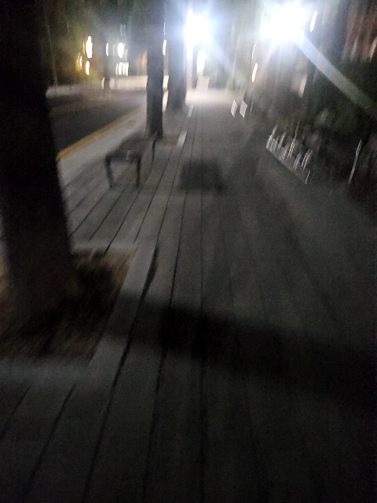</a><br>촬영 1 · 170.18초 · 프레임 830</td>
<td valign="top"><a href="photos/01-field/clip-01/t0175.02-f00854.jpg">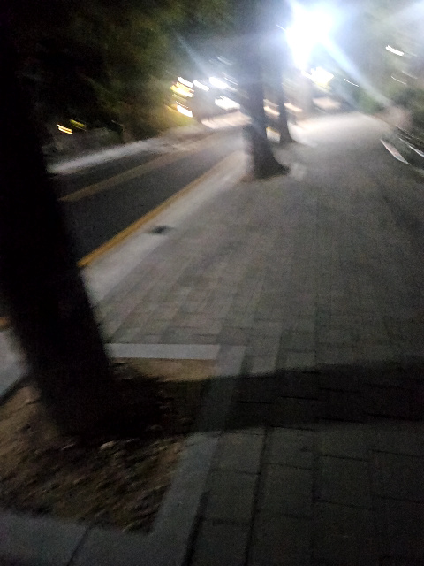</a><br>촬영 1 · 175.02초 · 프레임 854</td>
</tr>
</table>

</details>

<details>
<summary>촬영 2: NaVi-collect-20260919-023430-697-4a81ff58 · 사진 36장</summary>

<table>
<tr>
<td valign="top"><a href="photos/01-field/clip-02/t0000.07-f00002.jpg"></a><br>촬영 2 · 0.07초 · 프레임 2</td>
<td valign="top"><a href="photos/01-field/clip-02/t0004.97-f00026.jpg">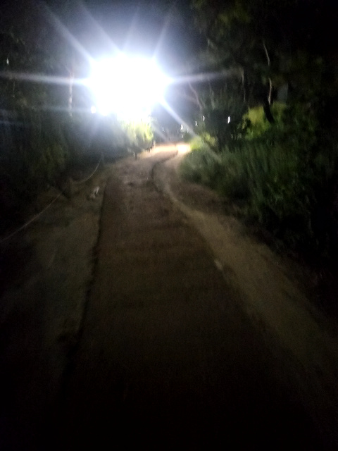</a><br>촬영 2 · 4.97초 · 프레임 26</td>
<td valign="top"><a href="photos/01-field/clip-02/t0010.00-f00051.jpg">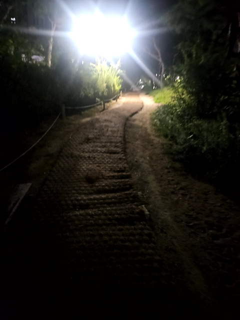</a><br>촬영 2 · 10.00초 · 프레임 51</td>
</tr>
<tr>
<td valign="top"><a href="photos/01-field/clip-02/t0014.98-f00075.jpg">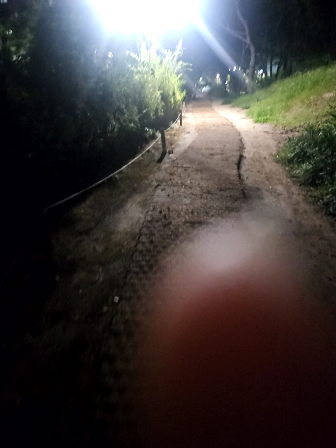</a><br>촬영 2 · 14.98초 · 프레임 75</td>
<td valign="top"><a href="photos/01-field/clip-02/t0020.06-f00099.jpg">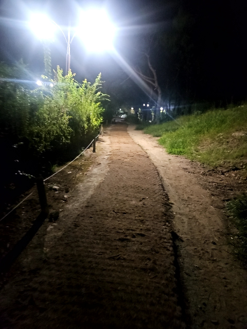</a><br>촬영 2 · 20.06초 · 프레임 99</td>
<td valign="top"><a href="photos/01-field/clip-02/t0025.09-f00122.jpg">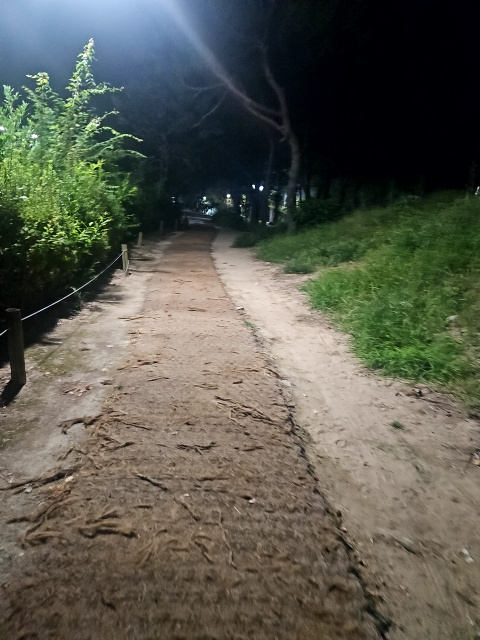</a><br>촬영 2 · 25.09초 · 프레임 122</td>
</tr>
<tr>
<td valign="top"><a href="photos/01-field/clip-02/t0030.05-f00145.jpg">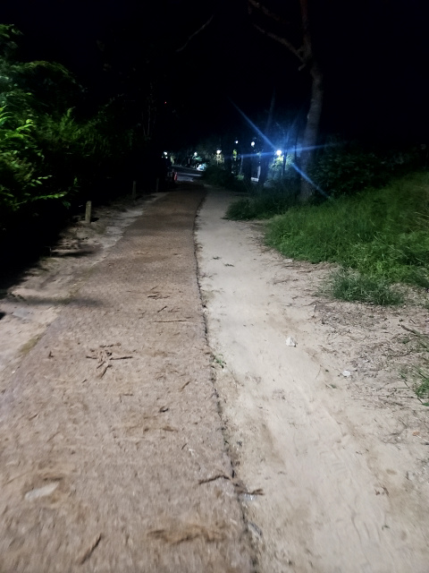</a><br>촬영 2 · 30.05초 · 프레임 145</td>
<td valign="top"><a href="photos/01-field/clip-02/t0035.04-f00168.jpg">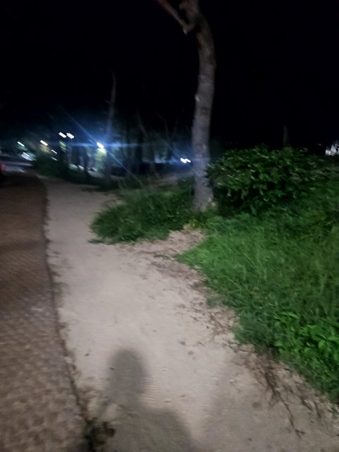</a><br>촬영 2 · 35.04초 · 프레임 168</td>
<td valign="top"><a href="photos/01-field/clip-02/t0039.84-f00192.jpg">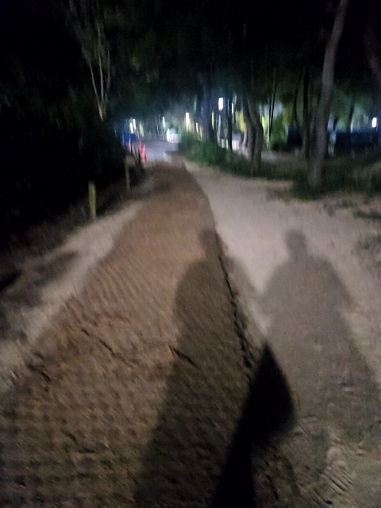</a><br>촬영 2 · 39.84초 · 프레임 192</td>
</tr>
<tr>
<td valign="top"><a href="photos/01-field/clip-02/t0045.07-f00218.jpg">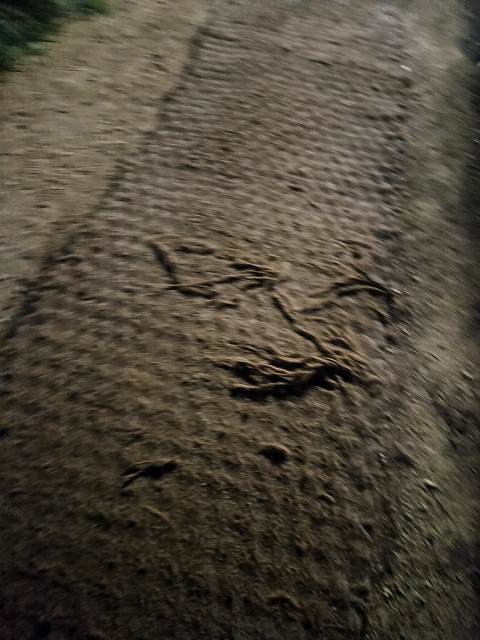</a><br>촬영 2 · 45.07초 · 프레임 218</td>
<td valign="top"><a href="photos/01-field/clip-02/t0050.10-f00243.jpg"></a><br>촬영 2 · 50.10초 · 프레임 243</td>
<td valign="top"><a href="photos/01-field/clip-02/t0054.90-f00267.jpg"></a><br>촬영 2 · 54.90초 · 프레임 267</td>
</tr>
<tr>
<td valign="top"><a href="photos/01-field/clip-02/t0059.93-f00292.jpg"></a><br>촬영 2 · 59.93초 · 프레임 292</td>
<td valign="top"><a href="photos/01-field/clip-02/t0065.12-f00318.jpg"></a><br>촬영 2 · 65.12초 · 프레임 318</td>
<td valign="top"><a href="photos/01-field/clip-02/t0069.95-f00342.jpg"></a><br>촬영 2 · 69.95초 · 프레임 342</td>
</tr>
<tr>
<td valign="top"><a href="photos/01-field/clip-02/t0074.97-f00367.jpg"></a><br>촬영 2 · 74.97초 · 프레임 367</td>
<td valign="top"><a href="photos/01-field/clip-02/t0079.99-f00392.jpg"></a><br>촬영 2 · 79.99초 · 프레임 392</td>
<td valign="top"><a href="photos/01-field/clip-02/t0085.00-f00417.jpg"></a><br>촬영 2 · 85.00초 · 프레임 417</td>
</tr>
<tr>
<td valign="top"><a href="photos/01-field/clip-02/t0090.19-f00443.jpg"></a><br>촬영 2 · 90.19초 · 프레임 443</td>
<td valign="top"><a href="photos/01-field/clip-02/t0094.92-f00466.jpg"></a><br>촬영 2 · 94.92초 · 프레임 466</td>
<td valign="top"><a href="photos/01-field/clip-02/t0100.14-f00490.jpg"></a><br>촬영 2 · 100.14초 · 프레임 490</td>
</tr>
<tr>
<td valign="top"><a href="photos/01-field/clip-02/t0104.84-f00512.jpg"></a><br>촬영 2 · 104.84초 · 프레임 512</td>
<td valign="top"><a href="photos/01-field/clip-02/t0110.08-f00538.jpg"></a><br>촬영 2 · 110.08초 · 프레임 538</td>
<td valign="top"><a href="photos/01-field/clip-02/t0115.09-f00563.jpg"></a><br>촬영 2 · 115.09초 · 프레임 563</td>
</tr>
<tr>
<td valign="top"><a href="photos/01-field/clip-02/t0119.91-f00587.jpg"></a><br>촬영 2 · 119.91초 · 프레임 587</td>
<td valign="top"><a href="photos/01-field/clip-02/t0124.91-f00612.jpg"></a><br>촬영 2 · 124.91초 · 프레임 612</td>
<td valign="top"><a href="photos/01-field/clip-02/t0129.94-f00637.jpg"></a><br>촬영 2 · 129.94초 · 프레임 637</td>
</tr>
<tr>
<td valign="top"><a href="photos/01-field/clip-02/t0134.98-f00662.jpg"></a><br>촬영 2 · 134.98초 · 프레임 662</td>
<td valign="top"><a href="photos/01-field/clip-02/t0139.99-f00687.jpg"></a><br>촬영 2 · 139.99초 · 프레임 687</td>
<td valign="top"><a href="photos/01-field/clip-02/t0144.99-f00711.jpg"></a><br>촬영 2 · 144.99초 · 프레임 711</td>
</tr>
<tr>
<td valign="top"><a href="photos/01-field/clip-02/t0150.02-f00735.jpg"></a><br>촬영 2 · 150.02초 · 프레임 735</td>
<td valign="top"><a href="photos/01-field/clip-02/t0154.94-f00758.jpg"></a><br>촬영 2 · 154.94초 · 프레임 758</td>
<td valign="top"><a href="photos/01-field/clip-02/t0159.98-f00783.jpg"></a><br>촬영 2 · 159.98초 · 프레임 783</td>
</tr>
<tr>
<td valign="top"><a href="photos/01-field/clip-02/t0164.80-f00807.jpg"></a><br>촬영 2 · 164.80초 · 프레임 807</td>
<td valign="top"><a href="photos/01-field/clip-02/t0170.06-f00833.jpg"></a><br>촬영 2 · 170.06초 · 프레임 833</td>
<td valign="top"><a href="photos/01-field/clip-02/t0175.04-f00857.jpg"></a><br>촬영 2 · 175.04초 · 프레임 857</td>
</tr>
</table>

</details>

<details>
<summary>촬영 3: NaVi-collect-20260919-024105-060-5a85f57b · 사진 9장</summary>

<table>
<tr>
<td valign="top"><a href="photos/01-field/clip-03/t0000.10-f00002.jpg"></a><br>촬영 3 · 0.10초 · 프레임 2</td>
<td valign="top"><a href="photos/01-field/clip-03/t0004.97-f00026.jpg"></a><br>촬영 3 · 4.97초 · 프레임 26</td>
<td valign="top"><a href="photos/01-field/clip-03/t0010.04-f00051.jpg"></a><br>촬영 3 · 10.04초 · 프레임 51</td>
</tr>
<tr>
<td valign="top"><a href="photos/01-field/clip-03/t0015.00-f00075.jpg"></a><br>촬영 3 · 15.00초 · 프레임 75</td>
<td valign="top"><a href="photos/01-field/clip-03/t0019.90-f00098.jpg"></a><br>촬영 3 · 19.90초 · 프레임 98</td>
<td valign="top"><a href="photos/01-field/clip-03/t0024.94-f00121.jpg"></a><br>촬영 3 · 24.94초 · 프레임 121</td>
</tr>
<tr>
<td valign="top"><a href="photos/01-field/clip-03/t0030.03-f00145.jpg"></a><br>촬영 3 · 30.03초 · 프레임 145</td>
<td valign="top"><a href="photos/01-field/clip-03/t0035.02-f00169.jpg"></a><br>촬영 3 · 35.02초 · 프레임 169</td>
<td valign="top"><a href="photos/01-field/clip-03/t0040.03-f00194.jpg"></a><br>촬영 3 · 40.03초 · 프레임 194</td>
</tr>
</table>

</details>

<details>
<summary>촬영 4: NaVi-collect-20260919-024204-341-339c8af2 · 사진 36장</summary>

<table>
<tr>
<td valign="top"><a href="photos/01-field/clip-04/t0000.09-f00002.jpg"></a><br>촬영 4 · 0.09초 · 프레임 2</td>
<td valign="top"><a href="photos/01-field/clip-04/t0004.98-f00025.jpg"></a><br>촬영 4 · 4.98초 · 프레임 25</td>
<td valign="top"><a href="photos/01-field/clip-04/t0009.97-f00048.jpg"></a><br>촬영 4 · 9.97초 · 프레임 48</td>
</tr>
<tr>
<td valign="top"><a href="photos/01-field/clip-04/t0015.08-f00072.jpg"></a><br>촬영 4 · 15.08초 · 프레임 72</td>
<td valign="top"><a href="photos/01-field/clip-04/t0020.00-f00096.jpg"></a><br>촬영 4 · 20.00초 · 프레임 96</td>
<td valign="top"><a href="photos/01-field/clip-04/t0025.00-f00121.jpg"></a><br>촬영 4 · 25.00초 · 프레임 121</td>
</tr>
<tr>
<td valign="top"><a href="photos/01-field/clip-04/t0030.03-f00146.jpg"></a><br>촬영 4 · 30.03초 · 프레임 146</td>
<td valign="top"><a href="photos/01-field/clip-04/t0035.05-f00171.jpg"></a><br>촬영 4 · 35.05초 · 프레임 171</td>
<td valign="top"><a href="photos/01-field/clip-04/t0040.05-f00196.jpg"></a><br>촬영 4 · 40.05초 · 프레임 196</td>
</tr>
<tr>
<td valign="top"><a href="photos/01-field/clip-04/t0045.07-f00221.jpg"></a><br>촬영 4 · 45.07초 · 프레임 221</td>
<td valign="top"><a href="photos/01-field/clip-04/t0049.89-f00245.jpg"></a><br>촬영 4 · 49.89초 · 프레임 245</td>
<td valign="top"><a href="photos/01-field/clip-04/t0054.90-f00270.jpg"></a><br>촬영 4 · 54.90초 · 프레임 270</td>
</tr>
<tr>
<td valign="top"><a href="photos/01-field/clip-04/t0059.97-f00294.jpg"></a><br>촬영 4 · 59.97초 · 프레임 294</td>
<td valign="top"><a href="photos/01-field/clip-04/t0065.05-f00317.jpg"></a><br>촬영 4 · 65.05초 · 프레임 317</td>
<td valign="top"><a href="photos/01-field/clip-04/t0069.89-f00341.jpg"></a><br>촬영 4 · 69.89초 · 프레임 341</td>
</tr>
<tr>
<td valign="top"><a href="photos/01-field/clip-04/t0074.85-f00365.jpg"></a><br>촬영 4 · 74.85초 · 프레임 365</td>
<td valign="top"><a href="photos/01-field/clip-04/t0080.04-f00389.jpg"></a><br>촬영 4 · 80.04초 · 프레임 389</td>
<td valign="top"><a href="photos/01-field/clip-04/t0085.12-f00413.jpg"></a><br>촬영 4 · 85.12초 · 프레임 413</td>
</tr>
<tr>
<td valign="top"><a href="photos/01-field/clip-04/t0089.83-f00435.jpg"></a><br>촬영 4 · 89.83초 · 프레임 435</td>
<td valign="top"><a href="photos/01-field/clip-04/t0094.94-f00459.jpg"></a><br>촬영 4 · 94.94초 · 프레임 459</td>
<td valign="top"><a href="photos/01-field/clip-04/t0100.02-f00483.jpg"></a><br>촬영 4 · 100.02초 · 프레임 483</td>
</tr>
<tr>
<td valign="top"><a href="photos/01-field/clip-04/t0105.06-f00507.jpg"></a><br>촬영 4 · 105.06초 · 프레임 507</td>
<td valign="top"><a href="photos/01-field/clip-04/t0109.92-f00529.jpg"></a><br>촬영 4 · 109.92초 · 프레임 529</td>
<td valign="top"><a href="photos/01-field/clip-04/t0115.07-f00553.jpg"></a><br>촬영 4 · 115.07초 · 프레임 553</td>
</tr>
<tr>
<td valign="top"><a href="photos/01-field/clip-04/t0120.00-f00576.jpg"></a><br>촬영 4 · 120.00초 · 프레임 576</td>
<td valign="top"><a href="photos/01-field/clip-04/t0124.97-f00599.jpg"></a><br>촬영 4 · 124.97초 · 프레임 599</td>
<td valign="top"><a href="photos/01-field/clip-04/t0130.02-f00624.jpg"></a><br>촬영 4 · 130.02초 · 프레임 624</td>
</tr>
<tr>
<td valign="top"><a href="photos/01-field/clip-04/t0134.92-f00647.jpg"></a><br>촬영 4 · 134.92초 · 프레임 647</td>
<td valign="top"><a href="photos/01-field/clip-04/t0139.91-f00670.jpg"></a><br>촬영 4 · 139.91초 · 프레임 670</td>
<td valign="top"><a href="photos/01-field/clip-04/t0144.92-f00693.jpg"></a><br>촬영 4 · 144.92초 · 프레임 693</td>
</tr>
<tr>
<td valign="top"><a href="photos/01-field/clip-04/t0149.94-f00717.jpg"></a><br>촬영 4 · 149.94초 · 프레임 717</td>
<td valign="top"><a href="photos/01-field/clip-04/t0155.07-f00742.jpg"></a><br>촬영 4 · 155.07초 · 프레임 742</td>
<td valign="top"><a href="photos/01-field/clip-04/t0160.10-f00767.jpg"></a><br>촬영 4 · 160.10초 · 프레임 767</td>
</tr>
<tr>
<td valign="top"><a href="photos/01-field/clip-04/t0164.91-f00791.jpg"></a><br>촬영 4 · 164.91초 · 프레임 791</td>
<td valign="top"><a href="photos/01-field/clip-04/t0170.13-f00817.jpg"></a><br>촬영 4 · 170.13초 · 프레임 817</td>
<td valign="top"><a href="photos/01-field/clip-04/t0174.95-f00840.jpg"></a><br>촬영 4 · 174.95초 · 프레임 840</td>
</tr>
</table>

</details>

<details>
<summary>촬영 5: NaVi-collect-20260919-024719-670-dd86e6fb · 사진 36장</summary>

<table>
<tr>
<td valign="top"><a href="photos/01-field/clip-05/t0000.05-f00005.jpg"></a><br>촬영 5 · 0.05초 · 프레임 5</td>
<td valign="top"><a href="photos/01-field/clip-05/t0005.02-f00030.jpg"></a><br>촬영 5 · 5.02초 · 프레임 30</td>
<td valign="top"><a href="photos/01-field/clip-05/t0010.04-f00055.jpg"></a><br>촬영 5 · 10.04초 · 프레임 55</td>
</tr>
<tr>
<td valign="top"><a href="photos/01-field/clip-05/t0015.10-f00080.jpg"></a><br>촬영 5 · 15.10초 · 프레임 80</td>
<td valign="top"><a href="photos/01-field/clip-05/t0019.97-f00103.jpg"></a><br>촬영 5 · 19.97초 · 프레임 103</td>
<td valign="top"><a href="photos/01-field/clip-05/t0024.92-f00126.jpg"></a><br>촬영 5 · 24.92초 · 프레임 126</td>
</tr>
<tr>
<td valign="top"><a href="photos/01-field/clip-05/t0029.89-f00149.jpg"></a><br>촬영 5 · 29.89초 · 프레임 149</td>
<td valign="top"><a href="photos/01-field/clip-05/t0034.97-f00174.jpg"></a><br>촬영 5 · 34.97초 · 프레임 174</td>
<td valign="top"><a href="photos/01-field/clip-05/t0040.00-f00199.jpg"></a><br>촬영 5 · 40.00초 · 프레임 199</td>
</tr>
<tr>
<td valign="top"><a href="photos/01-field/clip-05/t0045.02-f00224.jpg"></a><br>촬영 5 · 45.02초 · 프레임 224</td>
<td valign="top"><a href="photos/01-field/clip-05/t0050.08-f00249.jpg"></a><br>촬영 5 · 50.08초 · 프레임 249</td>
<td valign="top"><a href="photos/01-field/clip-05/t0055.10-f00274.jpg"></a><br>촬영 5 · 55.10초 · 프레임 274</td>
</tr>
<tr>
<td valign="top"><a href="photos/01-field/clip-05/t0059.91-f00298.jpg"></a><br>촬영 5 · 59.91초 · 프레임 298</td>
<td valign="top"><a href="photos/01-field/clip-05/t0065.02-f00323.jpg"></a><br>촬영 5 · 65.02초 · 프레임 323</td>
<td valign="top"><a href="photos/01-field/clip-05/t0069.83-f00347.jpg"></a><br>촬영 5 · 69.83초 · 프레임 347</td>
</tr>
<tr>
<td valign="top"><a href="photos/01-field/clip-05/t0075.02-f00372.jpg"></a><br>촬영 5 · 75.02초 · 프레임 372</td>
<td valign="top"><a href="photos/01-field/clip-05/t0080.05-f00395.jpg"></a><br>촬영 5 · 80.05초 · 프레임 395</td>
<td valign="top"><a href="photos/01-field/clip-05/t0085.02-f00418.jpg"></a><br>촬영 5 · 85.02초 · 프레임 418</td>
</tr>
<tr>
<td valign="top"><a href="photos/01-field/clip-05/t0090.03-f00443.jpg"></a><br>촬영 5 · 90.03초 · 프레임 443</td>
<td valign="top"><a href="photos/01-field/clip-05/t0095.05-f00468.jpg"></a><br>촬영 5 · 95.05초 · 프레임 468</td>
<td valign="top"><a href="photos/01-field/clip-05/t0099.94-f00492.jpg"></a><br>촬영 5 · 99.94초 · 프레임 492</td>
</tr>
<tr>
<td valign="top"><a href="photos/01-field/clip-05/t0105.10-f00518.jpg"></a><br>촬영 5 · 105.10초 · 프레임 518</td>
<td valign="top"><a href="photos/01-field/clip-05/t0109.94-f00542.jpg"></a><br>촬영 5 · 109.94초 · 프레임 542</td>
<td valign="top"><a href="photos/01-field/clip-05/t0114.94-f00567.jpg"></a><br>촬영 5 · 114.94초 · 프레임 567</td>
</tr>
<tr>
<td valign="top"><a href="photos/01-field/clip-05/t0120.03-f00592.jpg"></a><br>촬영 5 · 120.03초 · 프레임 592</td>
<td valign="top"><a href="photos/01-field/clip-05/t0125.01-f00615.jpg"></a><br>촬영 5 · 125.01초 · 프레임 615</td>
<td valign="top"><a href="photos/01-field/clip-05/t0129.91-f00638.jpg"></a><br>촬영 5 · 129.91초 · 프레임 638</td>
</tr>
<tr>
<td valign="top"><a href="photos/01-field/clip-05/t0134.94-f00663.jpg"></a><br>촬영 5 · 134.94초 · 프레임 663</td>
<td valign="top"><a href="photos/01-field/clip-05/t0140.18-f00688.jpg"></a><br>촬영 5 · 140.18초 · 프레임 688</td>
<td valign="top"><a href="photos/01-field/clip-05/t0144.98-f00710.jpg"></a><br>촬영 5 · 144.98초 · 프레임 710</td>
</tr>
<tr>
<td valign="top"><a href="photos/01-field/clip-05/t0149.97-f00733.jpg"></a><br>촬영 5 · 149.97초 · 프레임 733</td>
<td valign="top"><a href="photos/01-field/clip-05/t0155.06-f00756.jpg"></a><br>촬영 5 · 155.06초 · 프레임 756</td>
<td valign="top"><a href="photos/01-field/clip-05/t0160.07-f00779.jpg"></a><br>촬영 5 · 160.07초 · 프레임 779</td>
</tr>
<tr>
<td valign="top"><a href="photos/01-field/clip-05/t0164.93-f00802.jpg"></a><br>촬영 5 · 164.93초 · 프레임 802</td>
<td valign="top"><a href="photos/01-field/clip-05/t0169.95-f00825.jpg"></a><br>촬영 5 · 169.95초 · 프레임 825</td>
<td valign="top"><a href="photos/01-field/clip-05/t0174.76-f00847.jpg"></a><br>촬영 5 · 174.76초 · 프레임 847</td>
</tr>
</table>

</details>

원본 ZIP 5개는 합계 약 2.13GiB로 로컬 `data/`에 보존했다. GitHub에는 원본 전체를 중복 업로드하지 않았다. [원본 목록](records/source_inventory.json)에 파일 위치·SHA-256·영상 해시가 있으며, [원본 manifest](records/source-manifests/)에는 프레임·센서 파일별 해시가 있다. 원본의 `calibration_status=pending`, `replay_eligible=false`는 그대로다.

## 촬영 당시 객체 인식 검토

기존 EfficientDet Lite0가 촬영할 때 저장한 출력을 검토했다. **이 단계는 새 추론이 아니다.** 콘 전용 분류를 추가하기 전이며, 장면 안내의 C01/C02/C03 문구를 정답 라벨로 사용하지 않았다.

| 클래스 | 저장된 박스 | 점수 0.6 이상 | 검토 내용 |
|---|---:|---:|---|
| 사람 | 212 | 47 | 지나가는 사람, 촬영자 신체, 그림자·배경 오검출이 섞임 |
| 자동차 | 583 | 10 | 차도 쪽 차량 표본과 원거리 판정 보류 표본 |
| 자전거 | 5 | 0 | 높은 점수의 C01 근거 없음 |
| 오토바이 | 3 | 0 | 동일 |
| 트럭 | 6 | 0 | 동일 |
| 고양이 | 379 | 129 | 검토한 20개 표본은 바닥·계단·그림자 등으로 보임 |

표는 주요 클래스만 표시한다. **전체 클래스 합계는 1,437박스**다. 정답을 전수 검수하지 않았으므로 정확도·재현율은 계산하지 않았다. 지원 클래스의 점수 0.6 이상 57개를 검토한 결과는 외부 사람 31, 촬영자 신체 10, 배경·그림자 5, 차도 쪽 차량 4, 판정 보류 7이다. 이 분류는 assistant 검토이며 `human_verified=false`다.

- [전체 분석 JSON](records/recorded-detector/analysis.json)
- [전체 탐지 CSV](records/recorded-detector/detections.csv)
- [57개 탐지의 검토 기록](records/recorded-detector/reviewed_detections.json)
- [장면 후보와 구간](records/recorded-detector/scene_candidates.json)

아래 시트의 박스는 저장된 결과를 사진 위에 그린 분석용 표시다. 당시 앱 화면을 캡처한 것이 아니다. 사람·자동차, 고양이 오검출, 전체 동선과 세부 구간을 보관했다.

<details>
<summary>C02-sequence-022341-01</summary>


</details>

<details>
<summary>C02-sequence-024204-01</summary>


</details>

<details>
<summary>cat-audit-sample-01</summary>


</details>

<details>
<summary>eligible-car-01</summary>


</details>

<details>
<summary>eligible-person-01</summary>


</details>

<details>
<summary>eligible-person-02</summary>


</details>

<details>
<summary>NaVi-collect-20260919-022341-193-a2b8792d-overview-01</summary>


</details>

<details>
<summary>NaVi-collect-20260919-022341-193-a2b8792d-overview-02</summary>


</details>

<details>
<summary>NaVi-collect-20260919-023430-697-4a81ff58-overview-01</summary>


</details>

<details>
<summary>NaVi-collect-20260919-023430-697-4a81ff58-overview-02</summary>


</details>

<details>
<summary>NaVi-collect-20260919-024105-060-5a85f57b-overview-01</summary>


</details>

<details>
<summary>NaVi-collect-20260919-024204-341-339c8af2-overview-01</summary>


</details>

<details>
<summary>NaVi-collect-20260919-024204-341-339c8af2-overview-02</summary>


</details>

<details>
<summary>NaVi-collect-20260919-024719-670-dd86e6fb-overview-01</summary>


</details>

<details>
<summary>NaVi-collect-20260919-024719-670-dd86e6fb-overview-02</summary>


</details>

<details>
<summary>preview_visual_check</summary>


</details>

검토용 영상도 같은 폴더에 포함했다. 원본 센서 Replay가 아닌 30fps 보기용 영상이다.

| 영상 | 원본과 구간 | 당시 판단 |
|---|---|---|
| [공사 구간](videos/C01_construction_diagnostic.mp4) | 촬영 1, 45~85초 | 기존 클래스 C01 통과로 계산하지 않음 |
| [경로 밖 차량 후보](videos/C02_vehicle_outside_candidate.mp4) | 촬영 4, 20~50초 | 차량과 보행로 분리 검토, 정지·점유 미확정 |
| [지나가는 사람 후보](videos/C03_passing_person_candidate.mp4) | 촬영 2, 70~100초 | 약 77~86초 통과 장면 |
| [손·그림자 진단](videos/D01_self_shadow_negative.mp4) | 촬영 5, 145~175초 | 외부 장애물과 촬영자·그림자 구분 |

## 콘 검출 실험

추가 촬영 없이 기존 5개 자료를 활용하기 위해 주황색, 흰 띠, 아래로 넓어지는 형태를 검사하는 `ConeShapeDetector`를 추가했다. 별도 신경망을 새로 학습한 것은 아니다. 기존 EfficientDet 가중치를 유지하고 실제 픽셀 기반 규칙 검출을 결합했다.

2,946개 CPU 프레임을 앱과 같은 Kotlin 검출기로 검사한 현재 결과는 **129프레임, 143박스**다. 점수는 규칙 충족 정도이며 보정된 확률이 아니다. 같은 자료를 개발과 확인에 사용했으므로 독립 평가도 아니다. 아래에는 초기 탐색본 5개 시트와 현재 규칙 8개 시트를 함께 보존했다. 143개라는 수치는 `current` 결과에만 적용한다.

<details>
<summary>초기 탐색 규칙: 5개 시트</summary>


</details>

<details>
<summary>현재 규칙: 8개 시트</summary>


</details>

- [프레임 입력 목록](records/cone/frames.tsv)
- [현재 콘 박스 좌표·점수](records/cone/cone_predictions.tsv)
- [검출 검사 로그](records/logs/cone-detector-test.log)

## 공간 판단과 우회 경로 변경

객체 박스를 그리는 것과 보행 경로를 실제로 막았다고 판단하는 것은 별개다. 기존 8구간 PoC 진단은 기록된 Depth·Semantics·AR pose를 사용했지만 초기 정렬을 가정한 진단이며 실측 지도 정합이 아니다.

| 콘이 나온 프레임의 마지막 판단 | 프레임 수 |
|---|---:|
| 거리 근거 부족 | 65 |
| 보행 영역 불확실 | 46 |
| 정지 지속 확인 중 | 8 |
| 추적·정렬 불가 | 8 |
| 이동 판단 | 2 |

2초 지속 조건까지 통과한 관측은 **0개**였다. 기존 녹화로 자동 우회가 성공했다고 결론 내리지 않았다. [프레임별 진단](records/cone/spatial_diagnostic.tsv)과 [원시 GPS·코스 대조](records/cone/course_correspondence.json)를 보관했다.

이후 사용자가 마지막 영상의 우회 동선을 명시하고 아래 합류점 종료를 선택했다. 현재 `Hackathon` 모드는 기존 Graph에 이미 있던 동쪽 곡선 보행로를 별도 내장 코스로 사용한다. 영상에서 새 지도 경로를 자동 복원한 것이 아니다.

- 출발: 위도 35.8463514, 경도 127.1319861. 남쪽 보행로를 바라본다.
- 장애물 앞에서 걸어온 길을 되돌아가 위쪽 연결부로 이동한다.
- 동쪽 곡선 보행로 `OSM_E_1327522116_93e880e796`을 따라 내려간다.
- 도착: 아래 합류점, 위도 35.8457996, 경도 127.1319938.
- 전환: 지정 구역의 실제 콘 인식이 이어지거나 사용자가 수동 우회 버튼을 누른다. 두 출처를 로그에 구분한다.
- 안내에는 내장 코스·모델·약도를 사용한다. 공용 Graph와 접근성 검증 상태는 바꾸지 않는다.

[현재 내장 코스 원본](records/course/jeonju_hackathon_course.json)을 포함했다. 사용자가 채팅에 그려 준 지도 이미지 자체는 이 아카이브에 포함하지 않았으며, 반영한 좌표·구간·방향은 이 설정으로 보존했다.

## 라인에서 화살표로

다음 두 이미지는 당시 화면 표현을 검토하기 위해 제작한 **영상 기반 AI 합성 설명 이미지**다. 실제 앱 스크린샷이나 ARCore 렌더 결과가 아니다. 이미지 자체의 표시와 생성 메타데이터도 보존했다.

### 초기 연속 라인·띠 표현


### 연속 화살표 표현


이후 실제 앱의 PoC AR 렌더러도 약 2m 간격의 파란 바닥 화살표로 변경했다. `FloorArrowGeometry.kt`가 경로의 진행 방향에 따라 삼각형을 만들고 `ArCoreNavigationView.kt`가 렌더링한다. 수평 바닥을 기준으로 하며 경사·굴곡의 정밀 추종은 범위에서 제외했다. 위 설명 이미지가 해당 구현의 현장 성공을 입증하는 자료는 아니다. [생성 메타데이터·프롬프트](records/ar-design/)를 함께 보관했다.

## 실제 앱의 중간 화면

아래는 보관된 실제 앱 캡처다. 파일명에 실행 시각·모드를 남겼다. 대부분 에뮬레이터 SelfTest·준비 화면이며, 마지막 수집 중단 저장 화면은 S23 기능 검사다. 표시된 130m 경로 등은 **당시 서버 기반 경로**다. 현재 지정 동쪽 코스 화면으로 해석하지 않는다.

<table>
<tr>
<td valign="top"><a href="photos/05-app-history/20260918-232900-134-selftest.png"></a><br>20260918-232900-134-selftest</td>
<td valign="top"><a href="photos/05-app-history/20260918-232958-515-selftest.png"></a><br>20260918-232958-515-selftest</td>
<td valign="top"><a href="photos/05-app-history/20260919-001653-914-selftest.png"></a><br>20260919-001653-914-selftest</td>
</tr>
<tr>
<td valign="top"><a href="photos/05-app-history/20260919-001747-626-selftest.png"></a><br>20260919-001747-626-selftest</td>
<td valign="top"><a href="photos/05-app-history/20260919-001836-056-selftest.png"></a><br>20260919-001836-056-selftest</td>
<td valign="top"><a href="photos/05-app-history/20260919-002108-845-live.png"></a><br>20260919-002108-845-live</td>
</tr>
<tr>
<td valign="top"><a href="photos/05-app-history/20260919-002119-706-selftest.png"></a><br>20260919-002119-706-selftest</td>
<td valign="top"><a href="photos/05-app-history/20260919-002156-446-selftest.png"></a><br>20260919-002156-446-selftest</td>
<td valign="top"><a href="photos/05-app-history/20260919-003043-750-selftest.png"></a><br>20260919-003043-750-selftest</td>
</tr>
<tr>
<td valign="top"><a href="photos/05-app-history/20260919-004727-063-selftest.png"></a><br>20260919-004727-063-selftest</td>
<td valign="top"><a href="photos/05-app-history/20260919-004804-777-selftest.png"></a><br>20260919-004804-777-selftest</td>
<td valign="top"><a href="photos/05-app-history/20260919-005040-007-selftest.png"></a><br>20260919-005040-007-selftest</td>
</tr>
<tr>
<td valign="top"><a href="photos/05-app-history/s23-collection-interrupted-and-saved.png"></a><br>S23 사례 수집 중단 후 저장 · 110프레임</td>
</tr>
</table>

[실행별 상태 요약](records/app_run_index.json), [개별 원본 실행 기록](records/app-runs/)에서 성공뿐 아니라 준비 거부·실패 상태도 확인할 수 있다.

## 검사 기록과 현재 상태

| 시점 | 검사 결과 | 검증 범위 |
|---|---|---|
| 고정 출발 PoC | Android 119개 통과, Python 181개 통과·2개 skip, 에뮬레이터 어댑터 9개 통과 | 상대 정렬·공간 판단·서버 계약·앱 기록 |
| 지정 동쪽 코스·화살표 | Android 125개 통과·2개 skip, 에뮬레이터 10개 통과 | 연결 불가능한 서버 주소에서도 내장 코스·모델 준비 |
| 객체 오버레이 수정 | 앱 단위 43개 통과·1개 skip, Debug/Benchmark 빌드, lint 오류 0 | 객체명·점수·색상 표시 코드, 문구 삭제 |

첫 오프라인 준비 검사에서 MediaPipe가 해제한 비트맵을 다시 읽는 오류가 발생했다. 이미지 해제 전에 콘 검출용 픽셀과 크기를 확보하도록 고친 뒤 10개 계측 검사를 통과했다. 초기 오류는 [당시 검증 JSON](records/verification/hackathon-east-delivery-20260919.json)에, 수정 후 통과 결과는 [계측 로그](records/logs/hackathon-east-instrumentation.log)에 기록돼 있다.

[검증 JSON 3개](records/verification/)에는 APK 해시와 당시 검사 범위가 있다. 최신 오버레이 APK SHA-256은 `f679f1a8572ea7c244cd15cfcfb44bb75ebfa332d42d381cddf7c0099c464a0a`다. APK 자체는 접속 설정이 포함될 수 있어 이 Git 보관 묶음에 넣지 않았다.

최신 코드는 실제 검출 결과에 이름·점수·종류별 색상을 표시한다. 시작 전 콘 미리보기, 시작 후 전체 탐지 결과 표시 구조다. 나무 클래스는 현재 객체 탐지 모델에 없다. 요청한 두 문구는 화면에서 삭제했으며 수동 전환과 실제 검출의 로그 구분은 유지한다.

**현재까지 확인하지 않은 항목:** 최신 S23 설치·전체 현장 동선 완주·절대 AR 위치 정확도·일반적인 통행 차단 판정 성능. 빌드와 에뮬레이터 검사가 이를 대신하지 않는다.

## 파일 구조와 재현

```text
README.md                     통합 문서와 사진 앨범
manifest.json                 각 파일의 출처·종류·원본/출력 SHA-256
photos/01-field/              5초 간격 현장 사진
photos/02-video-highlights/    원본 MP4 대표 장면
photos/03-recorded-detections/ 촬영 당시 모델 출력 검토 시트
photos/04-cone-experiments/    초기·현재 콘 실험 시트
photos/05-app-history/        실제 앱 중간 화면
photos/06-ar-design/          라인·화살표 설명 이미지
videos/                       보기용 영상 4개와 원본 프레임 추적 기록
records/                      통계·검출표·원본 manifest·검사 로그·문서 보관본
```

[집계 결과](records/summary.json), [파일 출처 목록](manifest.json)으로 수치와 이미지를 추적할 수 있다. 복사한 기록은 바이트 단위로 보존했고, 사진은 회전과 JPEG 내보내기를 명시했다. `frames.tsv`의 로컬 절대 경로는 저장소 상대 경로로 바꿨다. 원본 센서 ZIP·ARGB 버퍼·모델 가중치·접속 토큰은 포함하지 않는다.

기존 원본과 로컬 분석 자료가 있는 작업 폴더에서 재생성:

```powershell
.\.venv\Scripts\python.exe -X utf8 scripts/archive_jeonju_experiments.py
.\.venv\Scripts\python.exe -X utf8 scripts/verify_jeonju_experiment_archive.py
```

원본 분석 문서는 텍스트 스냅샷으로 보관했다. 아래 문서의 지시·수치·다음 단계는 **작성 당시 상태**이며 현재 상태는 이 통합 문서의 마지막 검사 표와 지정 코스 설정을 따른다. 보관본 안의 옛 로컬 링크는 원래 경로를 유지한다.

- [jeonju_cone_live_20260919.md](records/notes/jeonju_cone_live_20260919.md.txt)
- [jeonju_demo_implementation_20260918.md](records/notes/jeonju_demo_implementation_20260918.md.txt)
- [jeonju_field_case_analysis_20260919.md](records/notes/jeonju_field_case_analysis_20260919.md.txt)
- [jeonju_field_connection_20260919.md](records/notes/jeonju_field_connection_20260919.md.txt)
- [jeonju_fixed_course_delivery_20260919.md](records/notes/jeonju_fixed_course_delivery_20260919.md.txt)
- [jeonju_hackathon_preset_20260919.md](records/notes/jeonju_hackathon_preset_20260919.md.txt)
- [jeonju_one_button_collection_20260919.md](records/notes/jeonju_one_button_collection_20260919.md.txt)
- [jeonju_pre_demo_plan_20260919.md](records/notes/jeonju_pre_demo_plan_20260919.md.txt)
- [jeonju_reference_feedback_20260919.md](records/notes/jeonju_reference_feedback_20260919.md.txt)
